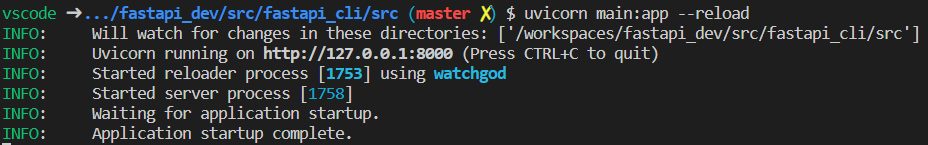
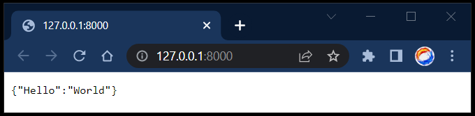
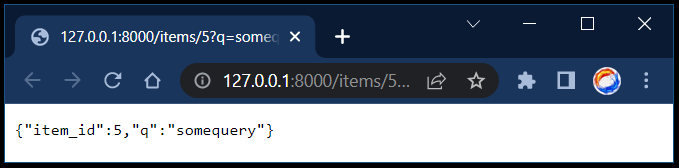
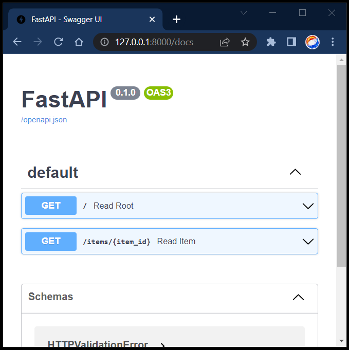

# [FastAPI CLI Example](https://fastapi.tiangolo.com/#example)

1. create [main.py](../src/main.py)
2. run

```shell
uvicorn main:app --reload
```





3. send a query

```shell
http://127.0.0.1:8000/items/5?q=somequery
```



4. get ineractive docs

```shell
http://127.0.0.1:8000/docs
```


