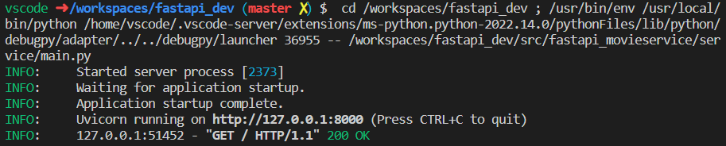
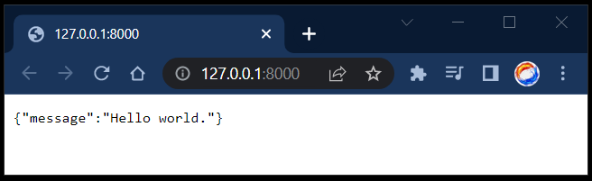

# FastAPI `movieservice`

This demo is based on the youtube tutorial presented by Michael Kennedy entitled "[Docker Build: Dockerizing a Python App with FastAPI](https://www.youtube.com/watch?v=qQNGw_m8t0Y)".

## Example

`https://movieservice.talkpython.fm/api/search/run` will produce:

```json
{
    "keyword": "run",
    "hits": [
        {
            "imdb_code": "tt0327850",
            "title": "The Rundown",
            "director": "Peter Berg",
            "keywords": [
                "jungle",
                "fight",
                "hunter",
                "amazon",
                "bounty hunter"
            ],
            "duration": 104,
            "genres": [
                "action",
                "adventure",
                "thriller",
                "comedy"
            ],
            "rating": "PG-13",
            "year": 2003,
            "imdb_score": 6.7
        },
        ...
```

(abridged output)

## FastAPI

```shell
pip install "fastapi[all]"
```

## Initial Demo

1. create initial [main_v1.py](../service/main_v1.py) code (v1)

2. run in debug, select file in Explorer and F5 to launch debug





3. add [movie_data.py](../service/movie_data.py) and test with updated [main.py](../service/main.py)

```shell
http://127.0.0.1:8000/api/movie/run
```

4. 

## [SSL: CERTIFICATE_VERIFY_FAILDED](https://stackoverflow.com/questions/50743896/python-requests-certificate-verify-failed-on-windows)

By default, Python requests-library in Windows does not use default Windows certificate store, but a PEM-file provided by https://pypi.org/project/certifi/.

To add a new CA root cert, do either one of these:

Find out where your PEM-file is stored at: python -c "import certifi ; print(certifi.where())", add your CA root cert to that file.
Install https://pypi.org/project/python-certifi-win32/ which will enable certifi to use Windows certificate store. Install your CA root cert there.

```SHELL
>python -c "import certifi ; print(certifi.where())"
C:\Users\<USERNAME>\.conda\envs\fastapi_dev39\lib\site-packages\certifi\cacert.pem
```

## References

* [FastAPI](https://fastapi.tiangolo.com/)
* [SSL: CERTIFICATE_VERIFY_FAILDED](https://stackoverflow.com/questions/50743896/python-requests-certificate-verify-failed-on-windows)
